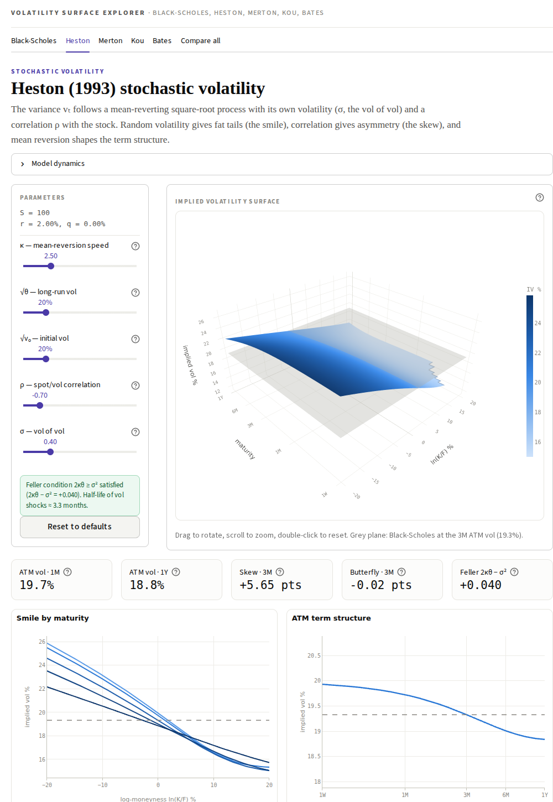
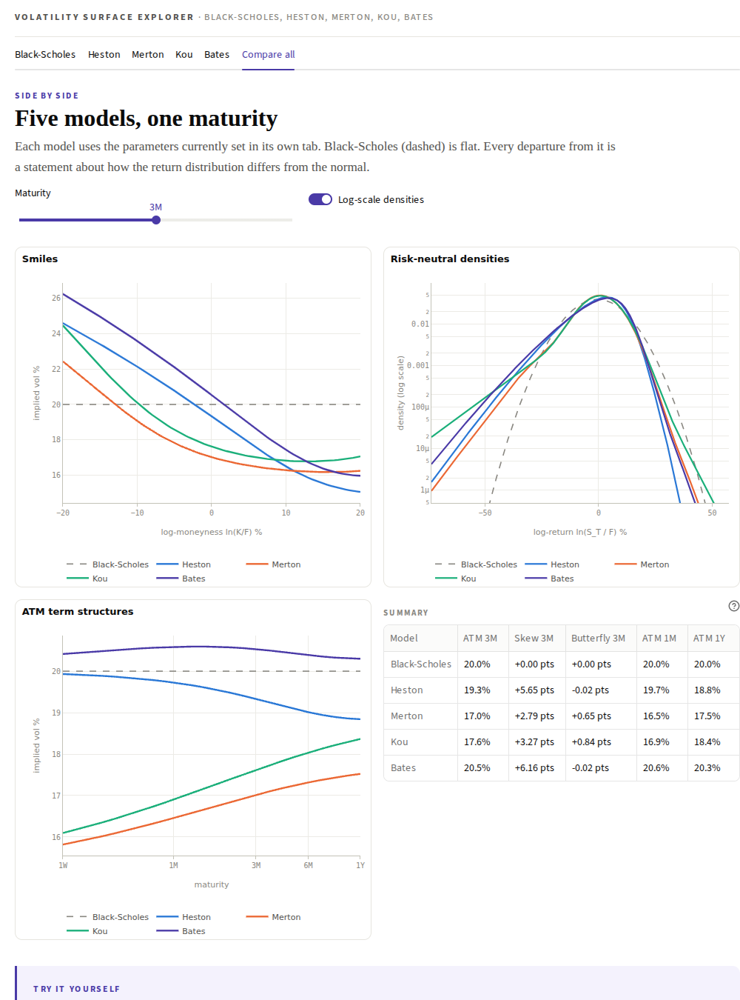

# Volatility Surface Explorer

**What does the implied-volatility surface look like when returns aren't normal?**

[](https://volatility-surface-explorer-puzgnmmnxcdaam6sq33tmt.streamlit.app)



An interactive explorer of implied-volatility surfaces for five option-pricing models:

| Model | What it adds to the flat Black-Scholes world |
|---|---|
| **Black-Scholes (1973)** | Nothing: one constant vol, so the surface is a flat plane. The reference. |
| **Heston (1993)** | Stochastic, mean-reverting variance correlated with the stock: skew from ρ, smile from vol-of-vol, term structure from κ. |
| **Merton (1976)** | Log-normal jumps: steep short-dated smile that flattens with maturity. |
| **Kou (2002)** | Double-exponential jumps with separate up and down tails. |
| **Bates (1996)** | Heston + Merton jumps: short-dated skew from jumps, long-dated skew from stochastic vol. |

Move the sliders and watch the surface change. Every parameter has a **?** explaining what it does.

## What each model tab shows

- **3D implied-vol surface**: maturity 1W–2Y × log-moneyness ln(K/F), with an optional grey **Black-Scholes plane** at the model's 3M ATM vol, which is how the surface would look if Black-Scholes were true.
- **Key numbers**: 1M and 1Y ATM vol, 3M skew (IV at −10% minus +10%), 3M butterfly (curvature), and the Feller condition or the jump share of variance.
- **Smile by maturity**, **ATM term structure** and **skew & curvature term structure**, each with the Black-Scholes reference.
- **Risk-neutral density** of ln(S_T/F) against the normal density Black-Scholes assumes (log scale shows the tails).
- **Model dynamics** (the SDEs) and a **Try it yourself** box of exercises.

The **Compare all** tab puts the five models side by side at one maturity: smiles, densities, ATM term structures and a summary table.



## Method

Prices come from each model's characteristic function via the **Lewis (2001)** single-integral formula

$$C = e^{-rT}\Big[F - \frac{\sqrt{FK}}{\pi}\int_0^\infty \mathrm{Re}\big(e^{iux}\,\varphi_T(u - \tfrac{i}{2})\big)\frac{du}{u^2 + \tfrac14}\Big],\qquad x = \ln\tfrac{F}{K},$$

integrated with composite Gauss-Legendre quadrature. The range adapts to maturity and volatility, and there is extra resolution near u = 0. Prices are accurate to about 1e-12 from 1 week to 2 years. Implied vols are inverted from **out-of-the-money** prices by bisection, and points whose price is below 1e-12 × spot are left blank because no implied vol can be read reliably there. Risk-neutral densities come from Fourier inversion of the same characteristic function.

Tests (`pytest -q`) check the pricer against closed-form Black-Scholes at every maturity and strike, the Merton series, Monte Carlo for Heston, Kou and Bates, and that every density integrates to 1 with E[e^X] = 1.

## Run locally

```bash
pip install -r requirements.txt
streamlit run app.py
```

## Deploy on Streamlit Community Cloud

1. Put all files in the **root** of a public GitHub repo, including the `.streamlit/config.toml` theme file.
   Uploading through the GitHub website? Create that one with **Add file → Create new file** and type
   `.streamlit/config.toml` as the name.
2. On [share.streamlit.io](https://share.streamlit.io): **Create app** → pick the repo → main file `app.py` → Deploy.

## Files

```
app.py            Streamlit UI
pricing.py        characteristic functions, Lewis pricer, implied vol, densities
surfaces.py       surfaces, smiles, term structures, summary numbers
charts.py         Plotly figures
content.py        model descriptions, parameter "?" help, exercises
test_pricing.py   tests
```

Companion project: **Market Making Simulator**. Quote options with Black-Scholes in a Heston, Merton or Bates world and watch model error turn into P/L.

## License

MIT
